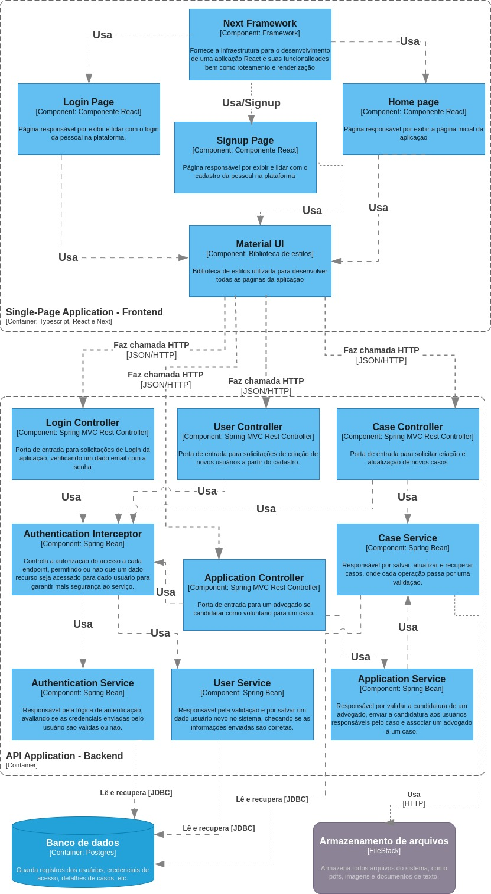

# Justiça para todos
Match entre pessoas de baixa renda (ou geral) e defensoria pública ou assessoramento/consultoria judicial.

*Resumo da ideia:* Nem todas as pessoas têm conhecimento sobre o pleito para um defensor público, seja para os mais diversos ramos do direito: trabalhista, família, criminal, cível, etc. A ideia é sobre a criação de uma aplicação de match entre usuário (restrito a baixa renda ou não) e profissionais experientes que queiram ser voluntários ou profissionais iniciantes que estejam estagiando ou querem ter experiência profissional. Os serviços podem variar de defensoria, assessoramento, consultoria ou mediação judicial.
A ideia pode abranger, ou ser exclusiva também,  uma plataforma de agendamento e transparência sobre a defensoria pública já existente.

## Arquitetura do Projeto
Atualmente, o projeto está dividido em dois grandes containers: O Front-End (aplicação em React e Typescript) e Back-end (aplicação em Java e Spring).

### Arquitetura C4 (Nível 3 - Componentes)
A arquitetura C4 em nível de componentes pode ser visualizada abaixo, juntamente com uma descrição sobre os principais componentes:

### Estilo de Arquitetura
TODO: Adicionar

### Descrição dos principais componentes

### User Service 

Este componente é responsável por fazer leitura e escrita no banco de dados de informações que são dos usuários, então fica atribuído a este componente a função de validar os dados antes de salvá-los e de processar os dados retirados do banco com o objetivo fornecer respostas mais estruturadas para quem o requisitou. 

### Application Service

Este componente realiza uma função de integração entre os demais componentes do sistema, sua responsabilidade é verificar se a candidatura de um advogado para trabalhar em um caso é válida, notificar o cliente que cadastrou o caso que há um advogado interessado em ajudar, notificar os advogados que estão trabalhando no caso em questão e associar o advogado ao caso fornecendo novas permissões para o advogado poder trabalhar no caso.

### Case Service

Guardar e recuperar casos do banco de dados é sua principal funcionalidade. Fornece um meio para consultar casos conforme os atributos desejados, como, por exemplo, busca por categoria e busca por perfil de cliente. 
