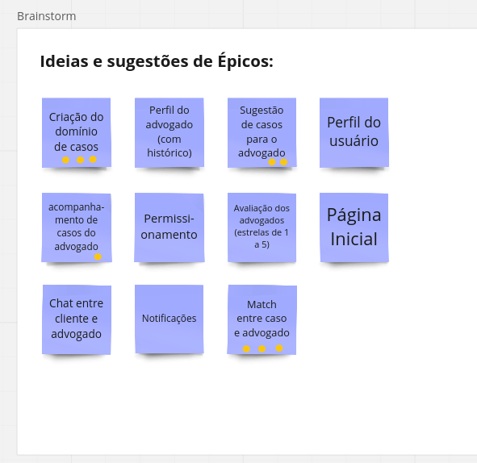

# Elicitação de Requisitos

Para a elicitação de requisitos, optamos por utilizar a abordagem do Brainstorming. A escolha dessa técnica foi feita considerando que, como o projeto ainda está muito no começo, diversos recursos-chaves e funcionalidades que são importantes para a integridade do sistema ainda não foram desenvolvidas. 

Assim, escolhemos usar o Brainstorm para pensar em requisitos importantes para o sistema e escolhê-los com base no que atualmente agregaria mais valor ao usuário final. A escolha dessas funcionalidades que serão priorizadas foram feitas a partir de discussões geradas com base nos resultados do Brainstorming, conforme será melhor explicado a seguir.

## Brainstorming

Conforme dito anteriormente, a técnica utilizada para a elicitação de requisitos foi o Brainstorming. Para isso, seguimos as seguintes etapas:

1. Nos juntamos em grupo e criamos um *board* no [Miro](https://miro.com).
   
2. No Miro, criamos um *board* no qual cada membro poderia, individualmente, escrever quantas ideias de requisitos e funcionalidades quisesse em formato de *cards*. A ideia é que fossemos extremamente flexíveis nas ideias escritas, sem barrar nada. Em outras palavras, deveríamos "escrever o que viesse à mente".

3. Após todos escreverem todas as ideias que surgiram à mente, passamos juntos por cada um dos requisitos elencados. A ideia é que quem tivesse escrito cada *card* pudesse dar uma aprofundada na ideia para que a mesma ficasse mais clara para todos do grupo. Como cada membro elencou as ideias individualmente durante o passo anterior, alguns *cards* ficaram duplicados ou semelhantes. Por isso, à medida que fomos passando por cada *card*, fomos excluindo requisitos duplicados ou agrupando ideias semelhantes em um único *card*.

4. Depois de passarmos e discutirmos todos os *cards* elencados, cada membro do grupo teve direito a 3 votos (que, no Miro, foi definido pelas bolinhas laranjas em cada *card*). O objetivo dessa votação era que, coletivamente, escolhessemos os requisitos que cada um julgasse que agregaria mais valor ao usuário final e, após todos opinarem, teríamos no final os três requisitos mais prioritários. Em caso de empate na votação, discutimos unitariamente cada um dos requisitos empatados considerando o valor que cada *feature* traria à aplicação considerando o estado atual do desenvolvimento para que, no final, as desempatássemos e tivéssemos apenas três requisitos "finais" que estariam ordenados por ordem de prioridade.

5. Tendo os três requisitos mais prioritários, consideramos esses como os próximos épicos que deveriam ser desenvolvidos para nosso sistema. Assim, continuamos com o desenvolvimento do projeto criando uma *Issue* para cada um desses requisitos.

**Board do Brainstorming:**

**Requisitos escolhidos por ordem de prioridade**

## Requisitos Prioritários

Conforme exibido na imagem anterior, os três requisitos que foram escolhidos priorizados com base no valor que agregarão ao projeto foram:

1. **Criação do Domínio de Casos.** Esse requisito diz respeito à permitir com que cada cliente consiga cadastrar um caso no sistema, de modo que, futuramente, um advogado possa analisá-lo e pegá-lo se houver algum interesse. Esse requisito empatou com o abaixo, mas escolhemos priorizá-lo pois consideramos que, no momento atual da aplicação, o requisito abaixo (Match entre caso e advogado) não agregaria nenhum valor à solução final caso a criação do domínio de casos não fosse desenvolvida uma vez que, para realizar o *match* de casos, é preciso que cada cliente consiga pelo menos cadastrar o caso que deseja obter uma ajuda de um advogado.

2. **Match entre caso e advogado.** Esse requisito é basicamente planejado para permitir com que um advogado e um cliente façam um "acordo" para que o caso comece a ser trabalhado por um advogado. Em outras palavras, seria a funcionalidade de um advogado aceitar algum caso aberto por um cliente.

3. **Sugestão de casos para o advogado.** Esse requisito busca tornar a experiência do advogado na seleção de casos mais natural, permitindo com que alguns casos ainda abertos sejam sugeridos à ele.